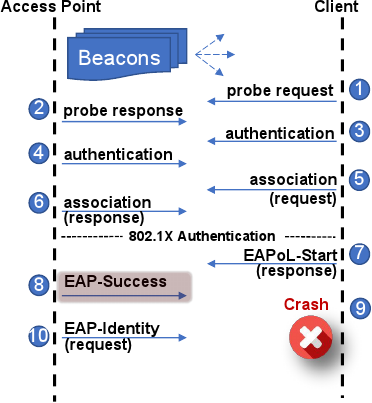
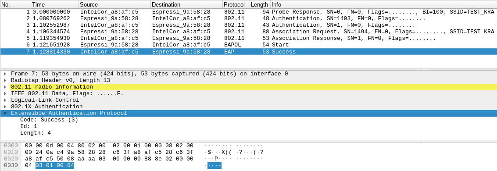

# Vulnerability Description

The vulnerability ([CVE-2019-12586](https://cve.mitre.org/cgi-bin/cvename.cgi?name=CVE-2019-12586)) found in SDKs of ESP32 and ESP8266 allows an attacker to precisely cause a crash in any ESP32/ESP8266 connected to an enterprise network. In combination with the  [Zero PMK Installation vulnerability](), it could increase the damages to any unpatched device.

The affected stable and development versions are listed below:

- ESP32-IDF Stable [release 3.0](https://github.com/espressif/ESP8266_NONOS_SDK/releases/tag/v3.0) and earlier. Vulnerable until **July 15, 2019**.
- ESP32-IDF Development Master [#b68f5b4f](https://github.com/espressif/esp-idf/commit/b68f5b4f8cae3d315a4d82dea5f5a623a18e0c72) and earlier. Vulnerable until **May 30, 2019**.
- Arduino-ESP32 Pre-release [1.0.3-rc2](https://github.com/espressif/arduino-esp32/releases/tag/1.0.3-rc2) and earlier. Vulnerable until **September 5, 2019.**
- Arduino-ESP32 Development Master [#aff2e42](https://github.com/espressif/arduino-esp32/commit/aff2e42ac612e32e6c52283e16d85d83ed6ef03b) and earlier.  Vulnerable until **May 12, 2019**.

# Exploit scenario

​	The DoS vulnerability can be better understood when presented in the following diagram below. Step 8 is the malicious message which could be injected by an attacker in radio range. In this case, if the ESP32/8266 Wi-Fi client receives a EAP-Success message just after starting the EAP procedure, it crashes immediately. This happens because the device is erroneously tries to finish the EAP procedure, but doesn't have a valid PMK exchanged and validated.

A Wireshark capture ([download](crash_capture.pcapng)) of the attacker triggering the crash is shown in the figure below:

# Impact

This vulnerability allows attackers in radio range to trigger a crash to any ESP device connected to an enterprise network. As the respective devices SDK (ESP-IDF for ESP32 and NONOS-SDK for ESP8266) enables watchdog by default, the devices won't hang in face of such DoS attack. Espressif has fixed such problem and committed patches for ESP32 SDK, however, as of the date of this post, the NONOS SDK and Arduino core for ESP8266 are still unpatched.

# Patches

Espressif has fixed such problem and committed patches for ESP32 SDK, however, as of the date of this post, the NONOS SDK and Arduino core for ESP8266 appears to be unpatched. The security patches can be tracked in the following commit link:

- [ESP32 ESP-IDF Stable Release 3.3 (5 September, 2019)](https://github.com/espressif/esp-idf/releases/tag/v3.3)
- [ESP32 ESP-IDF Development Master (30 May, 2019)](https://github.com/espressif/esp-idf/commit/8009320fb44abaf8acf8a1e1a38a67fc4c8d458c)
- [Arduino-ESP32 Stable Release 1.0.3 RC3 (5 September, 2019)](https://github.com/espressif/arduino-esp32/releases/tag/1.0.3-rc3)
- [Arduino-ESP32 Development Master (August  20,  2019)](https://github.com/espressif/esp-idf/commit/8009320fb44abaf8acf8a1e1a38a67fc4c8d458c)

# Proof of Concept tool

If you wish to test your ESP32/8266 device against this vulnerability, you can check my repository:

https://github.com/Matheus-Garbelini/esp32_esp8266_attacks