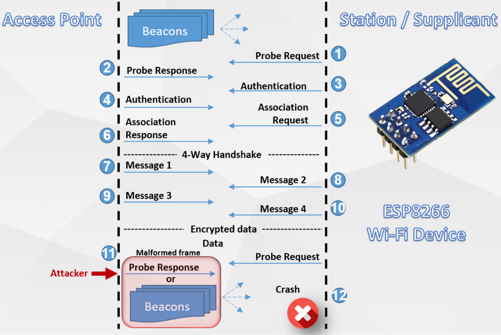
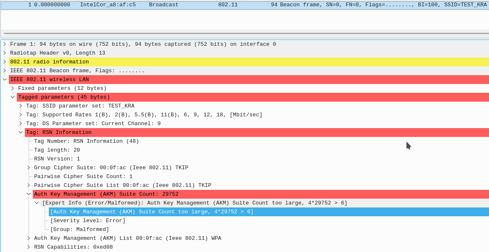
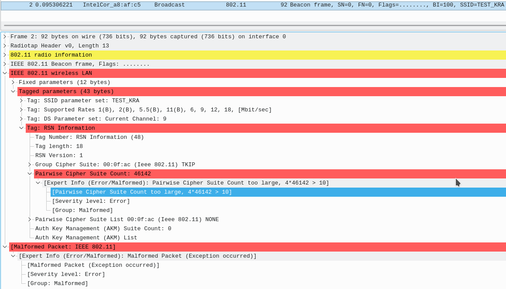

# Vulnerability Description

[CVE-2019-12588](https://cve.mitre.org/cgi-bin/cvename.cgi?name=CVE-2019-12588): The client 802.11 MAC implementation in Espressif ESP8266 **NONOS SDK 3.0 and earlier** does not validate correctly the RSN AuthKey suite list count in beacon frames, probe responses, and association responses, which allows attackers in radio range to cause a denial of service (crash) via a crafted message.

The affected stable and development versions are listed below:

- NONOS SDK Stable [release 3.0](https://github.com/espressif/ESP8266_NONOS_SDK/releases/tag/v3.0) and earlier. Vulnerable until **July 15, 2019**.
- NONOS SDK Development master [#b2db392](https://github.com/espressif/ESP8266_NONOS_SDK/commit/b2db392901bb54730b35947825a5f3f15e80eeb5) and earlier.  Vulnerable until **July 3, 2019**.
- NONOS SDK Backport 2.2.X [#9fe634e](https://github.com/espressif/ESP8266_NONOS_SDK/commit/9fe634e701f4f116912401c33ed8d297923bdbef) and earlier. Vulnerable until **July 3, 2019**.
- NONOS SDK Backport 3.0.0 [#fc04170](https://github.com/espressif/ESP8266_NONOS_SDK/commit/fc041703e0d900b8f4814f4f499e62599c626fae) and earlier. Vulnerable until **July 3, 2019**.
- Arduino ESP8266 Release 2.5.2 and earlier. **Still vulnerable as of September 5, 2019**.
- Arduino ESP8266 Development master [#a0634a7](https://github.com/esp8266/Arduino/commit/a0634a71a9240ea2ecb326d01159a31ae511a531). Vulnerable until **July 5, 2019**.

Two situations in a malformed beacon frame can trigger this problem:

* When sending crafted 802.11 frames with the field Auth Key Management Suite Count (AKM) in RSN tag with size too large or incorrect, ESP8266 in station mode crashes.
* When sending crafted 802.11 frames with the field Pairwise Cipher Suite Count in RSN tag with size too large or incorrect, ESP8266 in station mode crashes.

# Exploitation Scenario

The vulnerability can be better understood when presented in the following diagram:

In the scenario above, the attacker sends a malformed beacon or probe response to a ESP8266 which is already connected to an access point. However, it was found that ESP8266 can crash even when there's no connection to a AP, that is even when ESP8266 is just scanning for the AP.

When capturing some packets in Wireshark, it's easy to see which fields are affected. As shown in the figure below, the affected field is the **Auth Key Mangement (AKM) Suite Count**.

In this case, NONOS SDK is not verifying correctly AKM Suite count field against unexpected valued. This AKM field is used to tell how many authentication methods (suites) are allowed to be used during the key exchange with the AP. 

As for the **Pairwise Cipher Suite Count** field, which tells the client how many methods can be used for encryption,  a crash also occurs when the count number is higher then expected. This is exemplified in the figure below.

In both cases, ESP8266 NONOS SDK is not expecting to receive an exceeding value (6 and 10 in this case). This indicates that this attack may be triggering a buffer overflow. You can download the capture example of such crafted packet [here](esp8266-beacon-frame-crash.zip).

# Impact

As mentioned before, an attacker can crash any ESP8266 Wi-Fi client within radio range by just creating a fake beacon frame or probe response. This is specially dangerous for projects that are using ESP8266 for automation (e.g. [openplc project](https://www.openplcproject.com/)) which relies in operating actuators such as relays and motors while continuously communication with a programmable logic controller (PLC). In addition, products and projects that uses ESP8266 for smart home or as AT device are mostly vulnerable if their firmware was not recently updated.

# Patches

Espressif has fixed such problem and committed patches in their [NONOS SDK](https://github.com/espressif/ESP8266_NONOS_SDK) repository since July 3, 2019. The specific security patches can be tracked in the following commit/release links:

* [NONOS SDK Stable release 3.0.1 (July 15, 2019)](https://github.com/espressif/ESP8266_NONOS_SDK/releases/tag/v3.0.1)

- [NONOS SDK Development master (July 3, 2019)](https://github.com/espressif/ESP8266_NONOS_SDK/commit/9a17038b0fb3318a761c40ae6146c54d6a414ab4)
- [NONOS SDK Backport 2.2.X (July 3, 2019)](https://github.com/espressif/ESP8266_NONOS_SDK/commit/876abc5705d08f79f176988ddb5a6d077214c19c)
- [NONOS SDK Backport 3.0.0 (July 3, 2019)](https://github.com/espressif/ESP8266_NONOS_SDK/commit/9d591d14491a07a506b868d60f4ec12894702dc3)
- [Arduino ESP866 Development Master (July 5, 2019)](https://github.com/esp8266/Arduino/commit/403001e37c65994d241f284beba1d0171f5fb50e)

Make sure to update your SDK today, don't delay.

# Proof of Concept tool

If you wish to test your ESP8266 device against this vulnerability, you can check my repository:

https://github.com/Matheus-Garbelini/esp32_esp8266_attacks