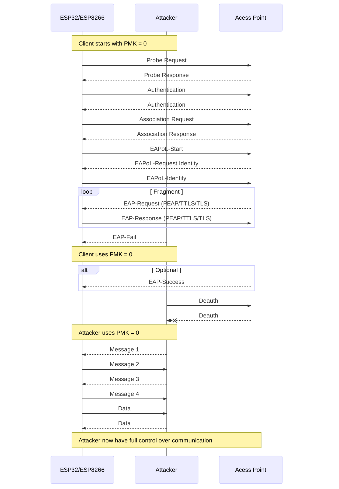
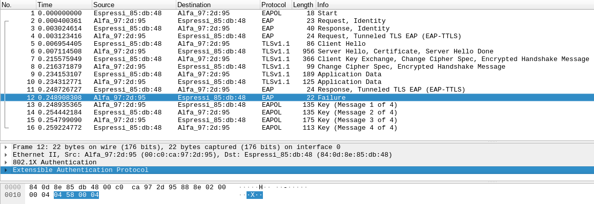

# Vulnerability Description

The vulnerability ([CVE-2019-12587](https://cve.mitre.org/cgi-bin/cvename.cgi?name=CVE-2019-12587)) found in SDKs of ESP32 and ESP8266 allows an attacker to take control of the Wi-Fi device in a enterprise network by sending an EAP-Fail message in the final step during connection between the device and the access point (AP). It was discovered that ESP32/ESP8266 devices updates their Pairwise Master Key (PMK) only when they receive an EAP-Success message. If an EAP-Fail message is received before the EAP-Success, the device skips updating the PMK received during a normal EAP exchange (EAP-PEAP, EAP-TTLS or EAP-TLS). Even in such situation, the device accepts normally the EAPoL 4-Way handshake which in turn establishes a session key based on this PMK.

Each time ESP32/ESP8266 starts, the PMK is initialised as zero, thus, if an EAP-Fail message is sent before the EAP-Success, the device uses a zero PMK. This allows an attacker to hijack the connection between the AP and the device.

The affected stable and development versions are listed below:

* ESP32-IDF Stable [release 3.0](https://github.com/espressif/ESP8266_NONOS_SDK/releases/tag/v3.0) and earlier. Vulnerable until **July 15, 2019**.
* ESP32-IDF Development Master [#b68f5b4f](https://github.com/espressif/esp-idf/commit/b68f5b4f8cae3d315a4d82dea5f5a623a18e0c72) and earlier. Vulnerable until **May 30, 2019**.
* Arduino-ESP32 Pre-release [1.0.3-rc2](https://github.com/espressif/arduino-esp32/releases/tag/1.0.3-rc2) and earlier. Vulnerable until **September 5, 2019.**
* Arduino-ESP32 Development Master [#aff2e42](https://github.com/espressif/arduino-esp32/commit/aff2e42ac612e32e6c52283e16d85d83ed6ef03b) and earlier.  Vulnerable until **May 12, 2019**.

# Exploitation scenario

​	The vulnerability can be better understood when presented in the diagram of the figure below. At the end of the exploit, the attacker has control over the encrypted Wi-Fi session of ESP32/ESP8266.

A Wireshark capture ([download](capture_vulnerability_TTLS.pcapng)) of the attacker triggering the vulnerability is shown in the figure below.

 The highlighted packet (Failure) is sent by the attacker, which then proceeds to send a Message 1, generated with a PMK (or pre-shared key) equal to zero. As you can see, the client normally responds with message 3 and 4 during the EaPoL handshake. Wi-Fi devices that are not vulnerable simply ignores such failure message and respond only when they received a valid message 1 from the real AP instead.

# Impact

Attackers can exploit this vulnerability to hijack ESP32/ESP8266 Wi-Fi clients connected to enterprise network without even knowing anything about username, password or certificates used during the enterprise keys exchanging methods (EAP-PEAP, EAP-TTLS or EAP-TLS). This allows an attackers in radio range to replay, decrypt, or spoof frames via a rogue access point, thus facilitating stealing of session keys/ usernames/passwords if communications betwen ESP an AP are not using TLS. This practically means that **unpatched ESP devices are more secure by actually using just WPA2 Personal.**

It's important to mention that attackers can also exploit [CVE-2019-12586]() and [CVE-2019-12588]() to force both ESP32 and ESP8266 to crash, which reinitialise the PMK to zero again.

# Patches

Espressif has fixed such problem and committed patches for ESP32 SDK, however, as of the date of this post, the NONOS SDK and Arduino core for ESP8266 appears to be unpatched. The security patches can be tracked in the following commit link:

- [ESP32 ESP-IDF Stable Release 3.3 (5 September, 2019)](https://github.com/espressif/esp-idf/releases/tag/v3.3)
- [ESP32 ESP-IDF Development Master (30 May, 2019)](https://github.com/espressif/esp-idf/commit/8009320fb44abaf8acf8a1e1a38a67fc4c8d458c)
- [Arduino-ESP32 Stable Release 1.0.3 RC3 (5 September, 2019)](https://github.com/espressif/arduino-esp32/releases/tag/1.0.3-rc3)
- [Arduino-ESP32 Development Master (August  20,  2019)](https://github.com/espressif/arduino-esp32/commit/d5e2bb12ca02ae9066e9dad84d9dbf268aca6fa3)

# Proof of Concept tool

If you wish to test your ESP32/8266 device against this vulnerability, you can check my repository:

https://github.com/Matheus-Garbelini/esp32_esp8266_attacks